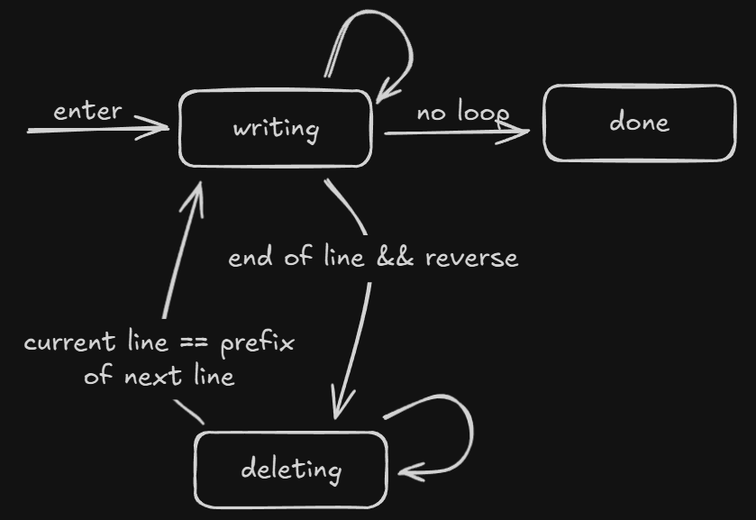

## I. The Idea

I wanted a cool typewriter effect on my landing page. Something cool, like someone typing on a keyboard. I
wanted it to **feel** like someone is typing, making mistakes, and deleting stuff as they do. I spent a bit of time
looking at what other people had built, but in the end I decided to build it myself. I couldn't find exactly the effect
I had in mind.

Something... like this:

~~~typewriter loop reverse

HEllo World!
Hello Wrdl
Hello World!!!!
Hello World :D
~~~

My first attempt was a naive implementation using a few `setTimeout`s.

~~~tsx
export function Typewriter({lines, className}) {
    const [displayedText, setDisplayedText] = useState("");
    const [line, setLine] = useState(0);

    useEffect(() => {
        if (displayedText.length < lines[line].length) {
            const timeout = setTimeout(() => {
                setDisplayedText(lines[line].slice(0, displayedText.length + 1));
            }, 100);
            return () => clearTimeout(timeout);
        }

        // we reached the end of the current line
        const timeout = setTimeout(() => {
            setLine((line + 1) % lines.length);
            setDisplayedText("");
        }, 1000);
        return () => clearTimeout(timeout);
    }, [displayedText, lines, line]);

    return (
         {displayedText}
            
        
    );
}
~~~

And the api is pretty straightforward, you provide an array of strings, className for styling, and it will display each
character of each string in order, then go to the next line and loop. Pretty neat.

~~~tsx
<Typewriter lines={["Hello World!", "This is the 2nd line.", "And the third!"]}/>
~~~

Then, it was time to add the *deleting* effect. Alright, easy enough, right? I'll add a `reverse` prop to tell the
typewriter to delete characters one by one instead of deleting the whole line. Oh and `loop` just in case I want to stop
when I reach the last line.
A few `setTimeout`s, a few `if else` and we're done!

Oh and also I want the typewriter to stop when the start of the **next** line matches the current one! This is cool. For
example, if the current line is "Hello World!" and the next is "Hello Aurore :)" then I want my typewriter to write
"Hello World!", then delete until it reaches "Hello ", and finally start writing "Hello Aurore :)" from there.
Not too difficult, when I'm deleting the text, I check if the current displayed text is a prefix of
the next line.

Oh.. but I need to check if we only have one line, because otherwise it will *always* be a prefix of the next line.
And I want to add a pause after the last line so the user can read the final message. Ok no more features.

After some time debugging everything and playing with the component, my `useEffect` was
looking like this:

~~~tsx
useEffect(() => {
        // check if we are deleting or not
        if (!isDeleting) {
            // pretty much the same as before
            if (displayedText.length < lines[line].length) {
                const timeout = setTimeout(() => {
                    setDisplayedText(lines[line].slice(0, displayedText.length + 1));
                }, 50);
                return () => clearTimeout(timeout);
            }
            // we reached the end of the current line

            // if we reverse, set isDeleting to true and start deleting
            if (reverse) {
                const timeout = setTimeout(() => {
                    setIsDeleting(true);
                }, 1000);
                return () => clearTimeout(timeout);
            }
            // otherwise, check if we are in the last line
            if (line === lines.length - 1) {
                if (loop) {
                    const timeout = setTimeout(() => {
                        setLine(0);
                        setDisplayedText("");
                    }, 3000);
                    return () => clearTimeout(timeout);
                }
                // no looping, we are done
                return;
            }
            // and finally, we can simply go to the next line
            const timeout = setTimeout(() => {
                setLine(line + 1);
                setDisplayedText("");
            }, 1000);
            return () => clearTimeout(timeout);
        }
        // we are deleting

        // ok before checking is we are a prefix of the next line, we should check if we are the only line
        if (lines.length === 1) {
            // we reached the end of the (only) line
            if (displayedText.length === 0) {
                const timeout = setTimeout(() => {
                    setIsDeleting(false);
                }, 1000);
                return () => clearTimeout(timeout);
            }
            const timeout = setTimeout(() => {
                setDisplayedText(displayedText.slice(0, displayedText.length - 1));
            }, 50);
            return () => clearTimeout(timeout);
        }
        // ok *now* we can check if we are a prefix of the next line
        if (lines[line + 1].startsWith(displayedText)) {
            const timeout = setTimeout(() => {
                setIsDeleting(false);
                setLine(line + 1);
            }, 1000);
            return () => clearTimeout(timeout);
        }
        // and *finally* we can delete a character
        const timeout = setTimeout(() => {
            setDisplayedText(displayedText.slice(0, displayedText.length - 1));
        }, 50);
        return () => clearTimeout(timeout);
    },
    [displayedText, lines, line, reverse, isDeleting, loop]
);
~~~

This mess is absolutely not readable, not maintainable, and it's a good example of what happens when you keep adding new
features on top of each other. I didn't need fancy machinery at first, so I didn't bother. I went from a simple
behavior to something a tiny bit more complex, the number of branches went from 2 to 8, and will continue to scale
exponentially with the number of features my state needs to manage. More than that, I will introduce bugs that I will
probably not even catch during development. Enters the state machine.

## II. Finite State Machines

I am a big fan of finite state machines, and I wanted to try XState for a long time, this was the perfect opportunity.
XState is very declarative, we write the states and the transitions, and it handles the rest. Our code is much easier to
read, and we can throw away a lot of cumbersome `if else` blocks. We first have to declare the states of our machine,
and for each of them we declare the transitions from that state to other states. We *guard* the transitions with
conditions based on some internal context that we carry around, and we can define actions to be applied when a
transition occurs (for example, set `context.text` to the new value, or `context.line` to the next).

The *state* of my component is now clear:

- either it is *writing*
- or it is *deleting*
- (or *done* but that state is trivial and has no transition to any other state)

And the transitions are also pretty straightforward:

- we (delete | write) a character based on the state
- while in *writing* mode, if we reach the end of the line, we check `reverse` and change state accordingly
- if it was the last line, depending on the `loop` prop, we change state accordingly
- if we are in *deleting* mode and we reach the end of the line, we simply change state

And after expressing the state machine with the XState syntax, it was just a matter of calling `useMachine` with our
state
machine and we were good to go!

~~~tsx
export function Typewriter({lines, loop = false, reverse = false, className}: TypewriterProps) {
    const [state, _send] = useMachine(typewriterMachine, {
        input: {
            lines,
            loop,
            reverse,
        },
    });
    return (
        {state.context.text}
            
        
    );
}
~~~